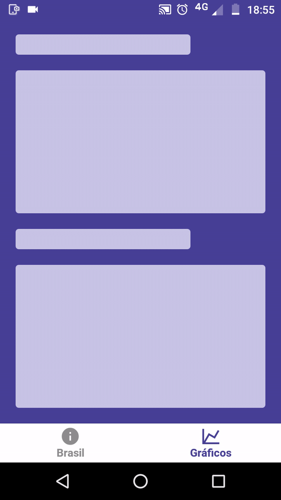

<div align="center">
  
</div>

<div align="center">
  
  &nbsp;&nbsp;&nbsp;&nbsp;&nbsp;&nbsp;&nbsp;&nbsp;&nbsp;&nbsp;&nbsp;&nbsp;
  
</div>

---

## :bookmark: Sobre

Aplicativo mobile feito em React Native sobre o covid-19 no **Brasil**. App mostra dados sobre o novo coronavírus como número de casos e mortes, além disso é acompanhado com gráficos de estatísticas. Os dados são atualizados diariamente através da API pública do **[Postman](https://documenter.getpostman.com/view/10808728/SzS8rjbc?version=latest)** e **[RapidAPI](https://rapidapi.com/Gramzivi/api/covid-19-data/endpoints)**.

---

## :computer: Tecnologias utilizadas

- axios
- date-fns
- expo
- react-native-skeleton-content
- react-native-svg-charts
- react-navigation
- styled-components

---

## :open_file_folder: Como baixar o projeto

```bash
  # Clonar repositório
  $ git clone https://github.com/netohelvecio/covid-19-brasil-app.git

  # Instalar o expo
  $ npm install --global expo-cli

  # Entrar na pasta do repositório
  $ cd covid-19-brasil-app

  # Instalar dependências
  $ yarn
  # ou
  $ npm -i

  # Inicar projeto
  $ expo start
```

---

Desenvolvido por Helvécio Neto
